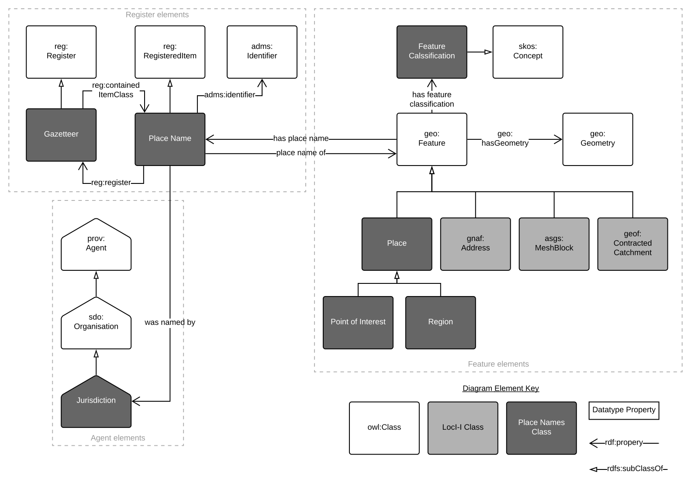

# Place Names Ontology
This ontology describes Place names that are used in the Composite Gazetteer of Australia. Place names are natural and artificial features and are all represented by points. Actual Place names are managed by multiple jurisdictions around Australia, while this ontology provides a meta model to bring their data together in one Linked Data collection.

This ontology will be published in two formats via an [Australian Government Linked Data Working Group](http://www.linked.data.gov.au) Persistent URI:
  * <http://linked.data.gov.au/def/placenames> - ontology documentation in HTML
  * <http://linked.data.gov.au/def/placenames.ttl> - ontology source in RDF (turtle)
    * also available via content negotiation

## Strategy for Place Names Ontology
This ontology profiles several other ontologies. It describes Place Names that are used in the Place Names Gazetteer of Australia. Place Names are names given to natural and artificial geospatial features, such as administrative areas, political regions, mountain ranges, rivers, bays etc. Place Names are assigned and managed by multiple Jurisdictions around Australia and may have varying status: official, historical etc. This ontology provides a meta model to bring Place Name data together in one Semantic Web data collection.

This profile is online at a persistent URI: <http://linked.data.gov.au/def/placenames>  

## Documentation
See the persistent online location above for documentation.

Additionally, the RDF source for this profile is available above and also here:
* [placenames.ttl](placenames.ttl) - in the Turtle format

The figure below, also at the online location, provides a quick overview of the ontology.
  
**Figure 1**: a diagrammatic overview of this ontology - not all details.

There are other images documenting parts o the ontology too:
* [hierarchy of classes in the profile](hierarchy.png)
* [Properties of the Place Names class](placename-properties.svg)

## Design choices
This ontology makes several design choices to facilitate certain behaviour. Some of those choices are listed below:

1. **Separation of `Place Name` from spatial objects**
  * the `Place Name` class, unlike in v1 of this profile/ontology, is not a spatial object and thus cannot be used with spatial properties such as geometry.
  * all `Place Name`s are just *names* - with authority, language, time period in effect, pronunciation etc. - but that they are separate from the actual *features* that they are names of. This ensures that `Place Names` are always bound to objects in other spatial Linked Data Datasets - perhaps specifically [Loc-I Datasets](http://linked.data.gov.au/def/loci#Dataset) - which means that the Place Names dataset is both well connected to these (and them to this) and also that this dataset just concentrates on names and hands off complex spatial concerns to other, dedicated, spatial systems
  * with this distinction, the Place Names dataset is a register (a catalogue of registered items), not a spatial dataset, first and foremost
1. **Jurisdictions are `Agent`s only**
  * i.e. `Jurisdiction` has no spatial component (the area a Jurisdiction has jurisdiction over)
  * this is to again ensure that any notion of spatiality is linked to existing (Loc-I) spatial objects, such as `States or Territories` in the [ASGS 2016](https://asgsld.net/2016/stateorterritory/), rather than re-defining them within this Place Names Profile
    * so, a `Place Name` (well, the `Feature` it is of) is *within* a, `ASGS State or Territory` or perhaps a Geofabric [Catchment](geofabricld.net/catchment/) rather than *within* a `Jurisdiction`
  * the role of a `Jurisdiction` within this profile is exactly that of a [PROV](https://www.w3.org/TR/prov-o/) `Agent`, that is to have things attributed to it. This profile is about `Place Names` and it's the creation of them that are attributed to `Jurisdictions` here
1. **Property chaining of `hasPlaceName`**
  * ...
1. **Implementing a vocabulary for Place Name Formality**
  * ...
1. **Declaring `Gazetteer` to be a `Register`**
  * ...

>>>>>>> master

## License
The content of this API is licensed for use under the [Creative Commons 4.0 License](https://creativecommons.org/licenses/by/4.0/). See the [license deed](LICENSE) all details.

## Contacts
**Geoscience Australia**  
*Publisher*  
<http://www.ga.gov.au>  
<clientservices@ga.gov.au>  

**Irina Bastrakova**  
*Ontology Author*  
*product owner*:  
Geoscience Australia, National Land Information  
<irina.bastrakova@ga.gov.au>  

**Nicholas Car**  
*Ontology Author*
CSIRO Land & Water, Environmental Informatics Group  
<nicholas.car@csiro.au>  

**Armin Haller**  
*Ontology Author*  
<armin.haller@anu.edu.au>  

